

  

    
  

  # NeatCode Grabber

  

## Welcome!

**NeatCode Grabber** is a simple chrome extension for uploading your [LeetCode](https://leetcode.com/) problem solutions to GitHub.

## Motivation

It's a short and simple story. 
I store my LeetCode problem solutions in a git repository, in order to keep them in a safe place.
I know that LeetCode [permanently](https://support.leetcode.com/hc/en-us/articles/360011934853-Why-all-my-solutions-in-the-code-editor-suddenly-went-missing) stores your submitted solutions, but I just like the idea of also storing them in a git repo.
However, the process of creating a new file, copy-and-pasting the code into it, staging it and then committing got to tedious for my lazy being.
This is why I decided to make this simple tool, which simply grabs and uploads the code for you.

If you also happen to have this extremely specific and (let's be honest) unnecessary problem, I hope this satisfies your needs. :D

## Features

- automatically detect problem ID, title and used programming language
- create new problem file
- update problem file
- check and show diff between local (the code in your browser) and remote (the code on GitHub) version
- copy remote version to clipboard
- dark and light appearance modes

NeatCode Grabber does NOT extract and upload the problem description.

## Tools & Frameworks

- [React](https://react.dev/): frontend framework
- [chakra](https://v2.chakra-ui.com/): a React component library
- [Vite](https://vitejs.dev/): local dev server

## Setup & Usage Guide

1. Go download the [latest release](https://github.com/Kangonaut/neat-code-grabber/releases/latest) and extract the archive.
1. Open your [Chromium](https://www.chromium.org/Home/) based browser. (e.g.: [Brave](https://brave.com/), [Opera](https://www.opera.com/), [Google Chrome](https://www.google.com/chrome/), ...)
1. Open the context menu (usually three lines or dots in the top right corner) and click on `Extensions` (sometimes `Extensions > Manage Extensions`).
1. Enable `Developer mode`.

    

      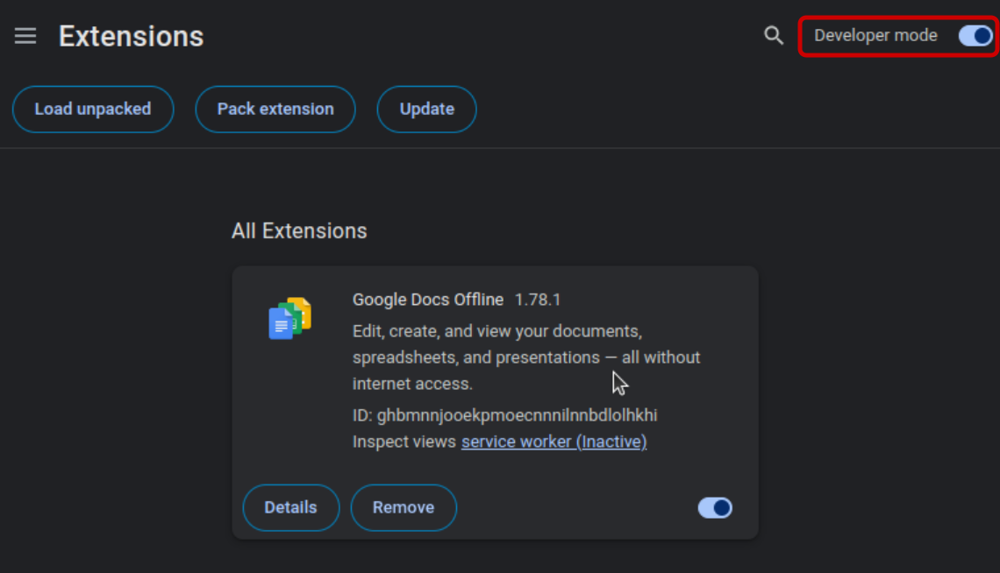
    

1. Click the newly appeared `Load unpacked` option and navigate to the storage location of the application folder.
1. Make sure the chosen folder contains the `index.html` and `manifest.json` files.
1. Now pin the extension to make your life easier.

    

      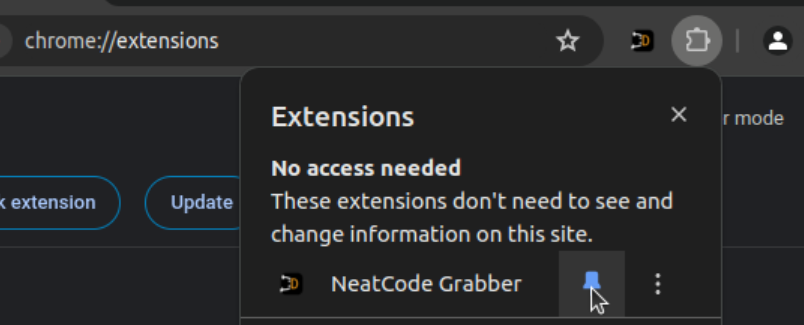
    

1. When clicking on the extension, a popup will appear that links to the options page.

    

      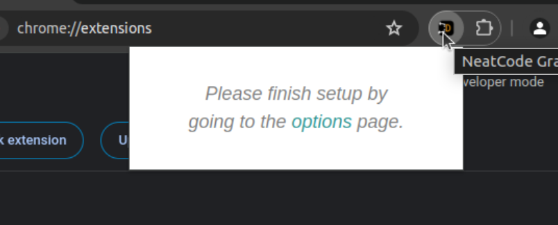
    

1. In the options menu, the first thing you should do is change the appearance to `Dark`, which will boost your coding skills by a `10x` modifier.

    

      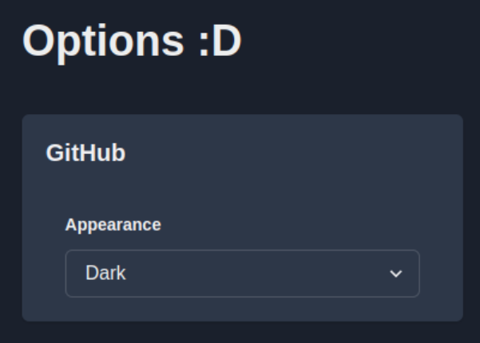
    

1. I assume that you already have a GitHub repository for your LeetCode solutions. If not, create one now.
1. Then you will have to configure some GitHub stuff.
    1. your GitHub API token: you need to create a fine-grained personal access token (see [this guide](https://docs.github.com/en/authentication/keeping-your-account-and-data-secure/managing-your-personal-access-tokens#creating-a-fine-grained-personal-access-token)) that has read and write access to your repository `Contents`
    1. your GitHub username
    1. your GitHub commit email address (which you can find [here](https://github.com/settings/emails))
    1. your repository name
1. Don't forget to hit the `save` button.
1. Now go and solve a LeetCode problem (e.g. [Two Sums](https://leetcode.com/problems/two-sum/))
1. When you are happy with your code, hit that extension button, check the info (problem ID, title and programming language) and upload using the `create` button.

    

      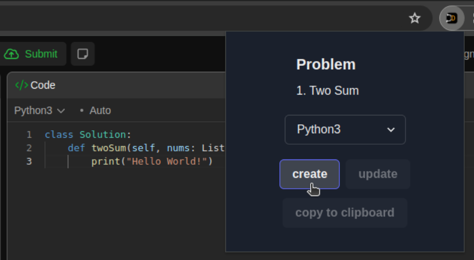
    

1. Assuming that my code works (I know, very risky) and that you have configured everything correctly, a success message should pop up.

    

      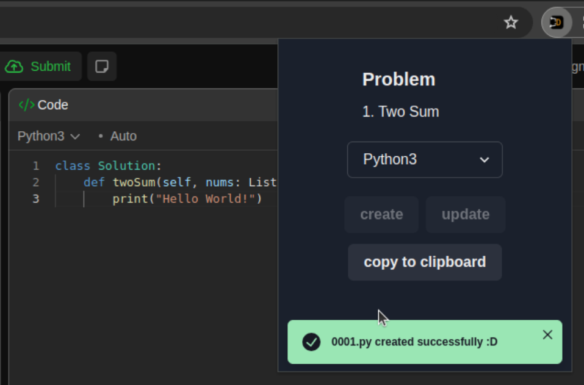
    

1. When you change the code and reopen the extension, it should show a `hide diff` button that will expand the diff view between the local and remote versions.

    

      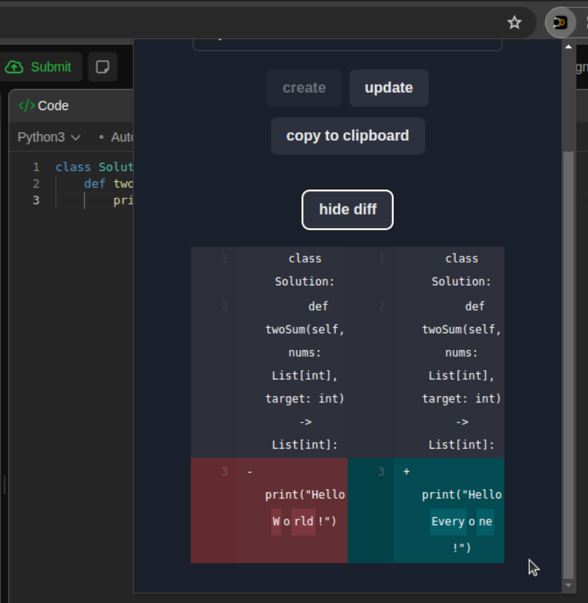
    

1. In case you want to get the content of the remote file (on the GitHub repo), just hit `copy to clipboard`.
1. And `update` simply updates the remote file to reflect your new changes.
1. If you visit your GitHub repo, you should now see your uploaded code.

    

      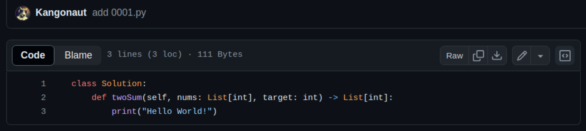
    

## Known Issues

I have not yet found a reliable way for extracting the code in the editor window other than going through the corresponding HTML tags and extracting the `textContent`. This works fine in most cases, however, when a line is too long it starts wrapping around, which is displayed as if the rest of the code were on a new line.

  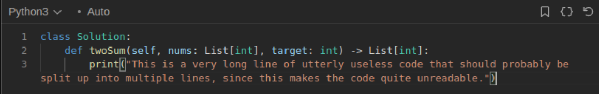

This means that NeatCode Grabber also interprets this as a new line, thus you get this undesired newline char in the middle of your code. When you check the actual file content on the GitHub repo, you can verify this.

  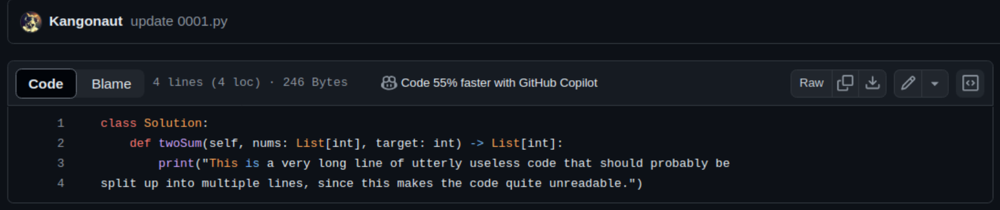

My current workaround is simply to make the code editor bigger until there are no line wraps, before I upload my code. I know it's far from optimal, but it also doesn't occur that often, at least for me personally.

  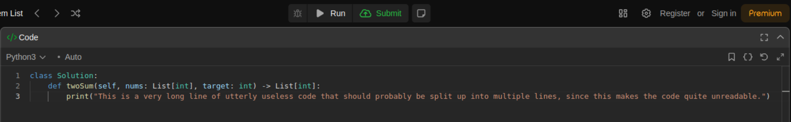

If you have any ideas how to solve this issue, I would be very happy. :D

## Contributing

Feel free to fork the project, create a feature branch, and send me a pull request!

## License

This project is licensed under the [MIT License](https://github.com/Kangonaut/neat-code-grabber/blob/main/LICENSE).

## Contact

You can reach out to me through [Reddit](https://www.reddit.com/user/Kangonaut/). I'd love to chat about this project or any other interesting topics!
